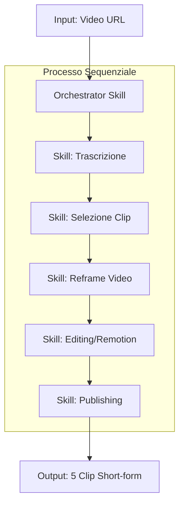
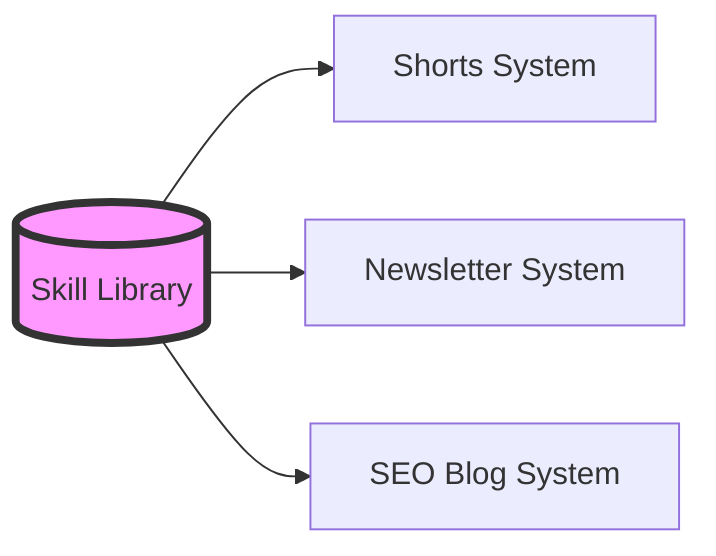

# Skill System: orchestrare skill AI modulari

Le skill AI sono utili quando trasformano conoscenza operativa in procedure riutilizzabili. Diventano molto meno efficaci quando vengono trattate come prompt isolati o, all'opposto, come grandi file monolitici che provano a gestire ogni fase del lavoro.

La domanda non è più: "quale skill posso chiamare?". La domanda giusta è: **come progetto un sistema di skill che lavori end-to-end, con passaggi chiari, output puliti e punti di controllo umani?**

Questo articolo descrive il pattern dello **Skill System**: una libreria di skill modulari coordinata da un orchestratore.

---

## 1. Due errori comuni nello sviluppo di skill AI

Prima di costruire pipeline complesse, conviene evitare due anti-pattern molto frequenti.

### Skill in totale isolamento

Il primo errore è usare ogni skill come endpoint singolo. Scarichi una skill per scrivere post LinkedIn, una per fare ricerca, una per generare immagini e una per programmare la pubblicazione, ma il collegamento tra le fasi resta tutto sulle tue spalle.

Il problema non è che la skill sia inutile. Il problema è che manca il sistema intorno.

In questo scenario l'utente resta il connettore manuale tra i processi:

- raccoglie input;
- copia output da un passaggio all'altro;
- pulisce testo intermedio;
- decide quando passare allo step successivo;
- verifica a mano coerenza e qualità.

Il risultato è un chatbot potenziato, non un workflow autonomo. L'AI aiuta, ma non riduce davvero il carico operativo.

### Mega-skill monolitiche

Il secondo errore nasce spesso come reazione al primo: mettere tutto in un unico `skill.md` gigantesco.

Sembra una soluzione perché concentra il workflow in un solo punto. In realtà introduce tre problemi tecnici:

| Problema | Effetto |
| -------- | ------- |
| Perdita di modularità | La logica di copywriting resta bloccata dentro quel flusso e non può essere riusata facilmente per newsletter, landing page o script video. |
| Manutenzione fragile | Cambiare una regola piccola obbliga a rileggere e ritestare l'intero monolite. |
| Degrado dell'output | Troppo contesto caricato insieme aumenta rumore, ambiguità e interferenza tra istruzioni non pertinenti. |

La correzione non è creare skill enormi. È progettare skill piccole, componibili e coordinate.

---

## 2. Cos'è uno Skill System

Uno **Skill System** è un set di istruzioni, prompt e procedure costruito attorno a più skill modulari. Al centro c'è un **orchestratore**, cioè una skill o un agente che decide quali moduli attivare, in quale ordine e con quali input.

Invece di avere un unico blocco che fa tutto, il sistema separa responsabilità diverse:

| Livello | Responsabilità |
| ------- | -------------- |
| Orchestratore | Legge l'obiettivo, sceglie le skill, gestisce ordine, checkpoint e handoff. |
| Skill specialistiche | Eseguono task stretti: trascrizione, selezione, editing, publishing, ricerca, scrittura. |
| Output intermedi | Passano da uno step all'altro in formato pulito e prevedibile. |
| Human-in-the-loop | Ferma il flusso nei punti in cui serve giudizio umano. |

Un esempio: trasformare un video long-form in cinque clip brevi per i social.



Ogni passaggio ha uno scopo preciso. L'orchestratore non trascrive, non edita e non pubblica direttamente: coordina.

---

## 3. I cinque pilastri dell'orchestrazione

Uno Skill System funziona solo se l'istruzione di orchestrazione definisce con precisione cinque elementi.

### Architettura delle skill

Il sistema deve dichiarare quali skill sono coinvolte e in quale ordine vengono eseguite.

Un ordine esplicito riduce decisioni implicite del modello. Se una pipeline video richiede prima trascrizione, poi selezione clip, poi reframe, poi editing, quell'ordine deve essere parte dell'istruzione.

### Requisiti di input

Ogni skill deve sapere cosa le serve per lavorare.

Una skill di trascrizione può richiedere un URL video. Una skill di reframe può richiedere timestamp, bounding box del volto e rapporto di destinazione. Una skill di publishing può richiedere titolo, descrizione, thumbnail e piattaforma.

Se gli input non sono espliciti, il sistema compensa con assunzioni. E le assunzioni sono il punto in cui i workflow iniziano a rompersi.

### Handoff degli output

Il passaggio tra skill deve essere progettato. L'output della Skill 1 non dovrebbe arrivare alla Skill 2 come testo libero pieno di ragionamenti, note e rumore.

Meglio produrre un formato intermedio stabile:

```json
{
  "clipCandidates": [
    {
      "start": "00:03:12.400",
      "end": "00:03:48.900",
      "hook": "Perche le mega-skill peggiorano l'output",
      "score": 87,
      "reason": "Apertura chiara, promessa forte, esempio tecnico concreto"
    }
  ]
}
```

Output pulito significa meno attrito nello step successivo.

### Checkpoint human-in-the-loop

Non tutto deve essere automatico. Nei processi business, alcuni passaggi devono fermarsi e chiedere approvazione.

Esempi:

- approvare clip selezionate prima dell'editing;
- scegliere tono e posizionamento prima del copywriting;
- verificare metadata e calendario prima della pubblicazione;
- controllare asset creativi prima della distribuzione.

Il checkpoint non è una debolezza del sistema. È il modo in cui l'automazione resta controllabile.

### Display dei risultati

Un workflow deve mostrare cosa sta succedendo. Può bastare un file Markdown con lo stato degli step, oppure una dashboard HTML, una cartella di asset generati o link diretti ai file finali.

La regola pratica: l'utente deve poter capire rapidamente dove si trova il processo, cosa è già pronto e cosa richiede intervento.

---

## 4. Case study: pipeline video modulare

Una pipeline per trasformare video long-form in contenuti social è un buon esempio perché contiene task molto diversi: analisi linguistica, scoring, computer vision, montaggio, packaging e pubblicazione.

| Skill | Funzione tecnica | Perché conta |
| ----- | ---------------- | ------------ |
| Transcript | Trascrizione word-level con timestamp | Serve per sincronizzare tagli, sottotitoli e animazioni grafiche. |
| Selection | Hook scoring e scelta clip | Valuta engagement, chiarezza, densità informativa e forza dell'apertura. |
| Reframe | Face detection e tracking | Converte landscape 16:9 in portrait 9:16 seguendo il volto o il soggetto principale. |
| Editing | Pop-out illustration e compositing | Genera grafiche o animazioni coerenti con keyword e momenti chiave. |
| Packaging | Metadata, thumbnail e scheduling | Prepara titolo, descrizione, copertina e pubblicazione su piattaforme esterne. |

La modularità è il punto decisivo. La skill di trascrizione non appartiene solo al sistema per short-form video: può essere riusata per newsletter, articoli SEO, archivi interni o ricerca semantica.

Allo stesso modo, una skill di hook scoring può servire per clip video, email subject line o titoli di landing page, se l'input è normalizzato e l'output è leggibile da altri step.

---

## 5. Gestione del contesto e riuso

Il vantaggio tecnico più importante di uno Skill System è la gestione del contesto.

Un agente non deve caricare tutte le istruzioni di tutte le skill in ogni momento. Deve caricare solo ciò che serve per lo step corrente.

Questo può avvenire tramite sub-agenti o tramite una libreria di skill selezionate dinamicamente:



Il beneficio è doppio:

- il modello lavora con una finestra di contesto più stretta e meno rumorosa;
- il team costruisce componenti riutilizzabili invece di riscrivere logica per ogni workflow.

La skill diventa un asset tecnico. Non è solo un prompt salvato: è un modulo operativo con input, output, responsabilità e confini.

---

## 6. Come progettare skill riutilizzabili

Una skill pensata per il riuso dovrebbe avere almeno cinque proprietà.

| Proprietà | Domanda guida |
| --------- | ------------- |
| Responsabilità singola | Questa skill fa una cosa precisa o prova a gestire mezzo workflow? |
| Input dichiarati | Quali dati servono prima di partire? |
| Output strutturato | Il risultato può essere letto senza interpretazione dallo step successivo? |
| Confini chiari | Cosa non deve fare questa skill? |
| Criterio di successo | Come capiamo che il risultato è buono? |

Una skill ben progettata non deve sapere tutto del sistema in cui verrà usata. Deve sapere fare bene il proprio pezzo.

L'orchestratore, invece, deve conoscere la mappa: quali moduli esistono, quando attivarli, come validare gli output e quando fermarsi per chiedere conferma.

---

## Conclusione

Non costruire endpoint. Costruisci sistemi.

Una skill isolata accelera un singolo passaggio, ma lascia all'utente tutto il lavoro di coordinamento. Una mega-skill monolitica nasconde complessità in un file enorme, difficile da mantenere e facile da confondere.

Uno Skill System trova equilibrio: skill piccole, riutilizzabili, con un orchestratore che gestisce ordine, input, handoff, checkpoint e risultati.

L'obiettivo non è produrre bozze AI più velocemente. L'obiettivo è creare workflow end-to-end che generano output di qualità, verificabili e pronti per essere usati.